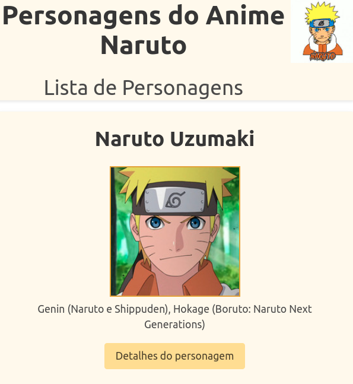

# Introdução
## Sobre o Projeto
Esta aplicação apresenta uma galeria de personagens do Anime Naruto, a qual permite verificar as características do personagem selecionado, incluindo história, ocupação e fotos.

## Tecnologias e Ferramentas empregadas
Node.js;
TypeScript;
Express;
Sequelize;
React.js;
CSS (framework: Bulma);
Redux;
React Router DOM;
Mysql; e
Docker.

## Status do Projeto
Aplicação em funcionamento.

## Acesso à Aplicação
### Antes da instalação
Fazer o Clone do repositório.

### Instalação e Execução
A. Entrar no diretório raiz:

  $ cd app-anime-naruto

B. Criar os containers através do comando:

  $ docker compose up

C. Serão iniciados os três containers:
  1. container docker db, com o banco de dados em MySQL;
  2. container docker back_anime-naruto, com o backend em Node.js; e
  3. container docker front_anime-naruto, com o frontend em Node.js.

D. Acessar através do navegador:
  
http://localhost:3000/

## Contribuintes
|Nome|GitHub|
| -------- | -------- |
|Moisés Fernandes|https://github.com/moisesfdasilva|

# Contato
[GitHub: Repositório-app-anime-naruto](https://github.com/moisesfdasilva/app-anime-naruto)
